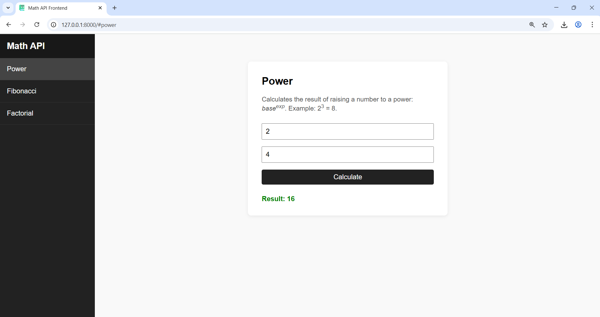
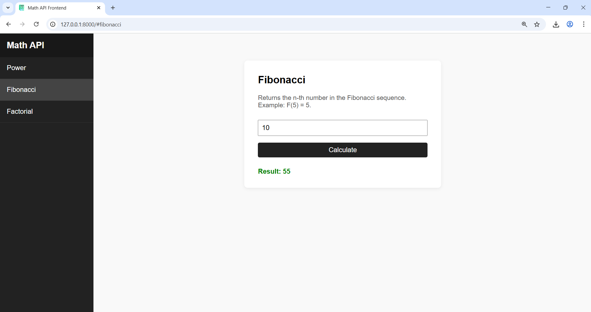
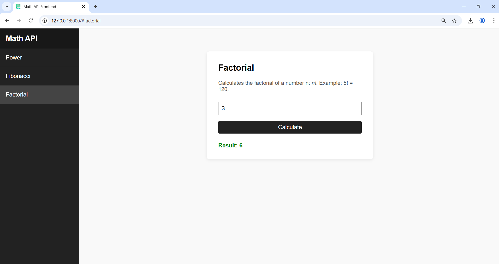
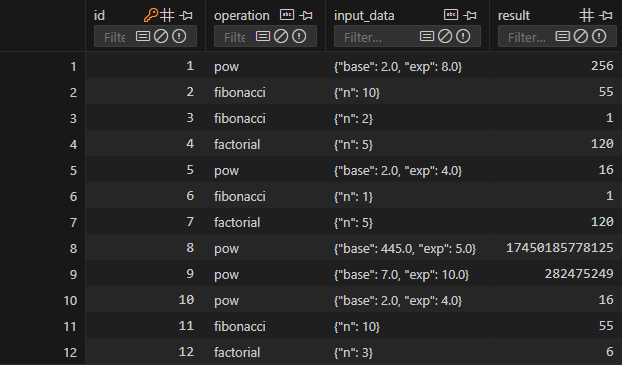

# PyOOP_MathApp

## Overview
MathApp is a modern, containerized Python web application that exposes mathematical operations (power, Fibonacci, factorial) via a REST API and a responsive Single Page Application (SPA) frontend. The backend is built with FastAPI, uses OOP principles, supports API key authentication, request logging, SQLite persistence, and is ready for deployment with Docker.

## Features
- **REST API** for mathematical operations: power, Fibonacci, factorial
- **OOP structure**: controllers, services, models, views
- **SQLite** persistence for request history
- **API key authentication** for all endpoints
- **Request logging** (local, extensible)
- **Health check endpoint**
- **Threaded background worker** for async tasks
- **LRU cache** for performance
- **SPA Frontend** (HTML/CSS/JS):
  - Responsive design (desktop/mobile)
  - Navbar for navigation
  - English interface
  - Pages for each operation
- **Dockerized**: Dockerfile & docker-compose for easy deployment
- **.env** support for configuration

## Project Structure
```
PyOOP_MathApp/
├── controllers/         # API logic (math_controller.py)
├── data/                # SQLite DB (requests.db)
├── frontend/            # SPA frontend (index.html, css, js, img)
├── models/              # Pydantic/data models
├── services/            # Business logic, worker, caching
├── views/               # FastAPI app (api.py)
├── utils.py             # Logging setup
├── main.py              # (Optional) Uvicorn entrypoint
├── requirements.txt     # Python dependencies
├── Dockerfile           # Docker build
├── docker-compose.yml   # Multi-container orchestration
├── .env                 # Environment variables
```

## How to Run

1. **With Docker**
   ```sh
   docker build -t math-api .
   docker run --rm --name mathapp -v "${PWD}/data:/app/data" -p 8000:8000 math-api
   ```
   The API and frontend will be available at `http://localhost:8000`.

2. **Locally (dev)**
   ```sh
   py -m pip install -r requirements.txt
   py -m uvicorn views.api:app --reload
   ```
   Then open `frontend/index.html` in your browser.

## API Endpoints
- `POST /pow`         – `{ "base": int, "exp": int }` → `{ "result": int }`
- `POST /fibonacci`   – `{ "n": int }` → `{ "result": int }`
- `POST /factorial`   – `{ "n": int }` → `{ "result": int }`
- `GET /health`       – Health check
- All endpoints require header: `x-api-key: secret123`

## Example Test Cases
### Power
- Request: `{ "base": 2, "exp": 3 }` → Response: `{ "result": 8 }`
- Request: `{ "base": 5, "exp": 0 }` → Response: `{ "result": 1 }`

### Fibonacci
- Request: `{ "n": 7 }` → Response: `{ "result": 13 }`
- Request: `{ "n": 0 }` → Response: `{ "result": 0 }`

### Factorial
- Request: `{ "n": 5 }` → Response: `{ "result": 120 }`
- Request: `{ "n": 0 }` → Response: `{ "result": 1 }`

### Health
- Request: `GET /health` → Response: `{ "status": "ok" }`

### Auth Error
- Request without `x-api-key` → Response: `401 Unauthorized`

## Example User Stories

### User Stories

- **End User:** As an end user, I need an intuitive web interface to perform mathematical operations (power, Fibonacci, factorial) efficiently, so that I can obtain accurate results for my calculations without technical barriers.
  - **Result:** The application provides a modern, easy-to-use SPA interface, with dedicated pages for each mathematical operation.
  <br>  
- **API Consumer:** As a software developer, I require a well-documented and secure REST API to programmatically access mathematical computations, enabling integration with other systems and automation of workflows.
  - **Result:** The REST API is documented in the README, uses API key authentication, and can be accessed from any client application.
- **System Administrator:** As a system administrator, I want all API requests to be authenticated, logged, and persisted in a database, so that I can ensure security, monitor usage, and facilitate auditing or troubleshooting.
  - **Result:** All requests are authenticated (API key), logged, and saved in the SQLite database for audit and monitoring.
  <br>
- **Mobile User:** As a mobile user, I expect the application’s frontend to be fully responsive, so that I can access all features seamlessly from any device, regardless of screen size.
  - **Result:** The frontend is fully responsive and optimized for any screen size (desktop, tablet, mobile).

## Testing
The API was tested using [Postman](https://www.postman.com/) for all endpoints and authentication scenarios.

## Authors
- Danca Alexandra Simona

